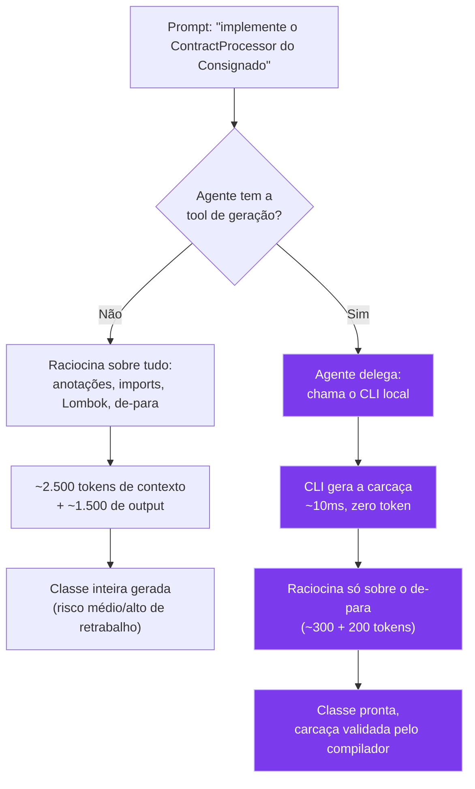
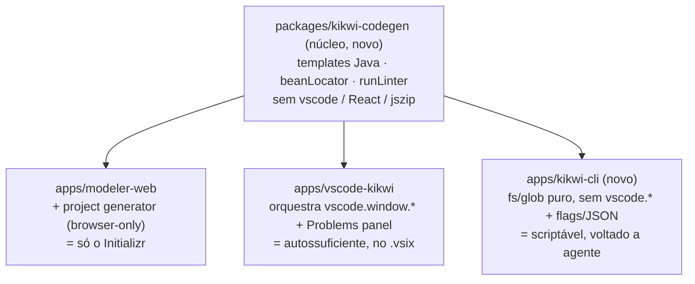

Esses dias um grande amigo me mandou "cara, e aquele teu blog?" — e fiquei pensando: pois é, por que eu não volto a postar?

Nos últimos dois anos eu me fechei numa espécie de caverna, focado nos meus objetivos, e isso vem dando muito certo: aprendi mais do que em todos os anos anteriores somados, mesmo sabendo que o que sei ainda é um pingo no oceano. Foi uma trajetória sair de servente de obras até fundar uma empresa, e acho que o que vivi pode ajudar alguém por aí — e, quem sabe, um dia ajudar minha filha a entender como funcionava a cabeça do pai.

Pra esse retorno, não vim filosofar. Vim contar como o processo de criar as tools do Kikwiflow me fez trocar de IDE Java — e como, em projetos grandes, pequenas decisões de Developer Experience acabam pesando no FinOps, na governança de conhecimento e na produtividade, seja de dev humano ou de agente.

Essa troca de IDE não nasce de insatisfação com o IntelliJ — ele continua sendo, na minha visão, o padrão-ouro pra análise estática e refatoração de código Java escrito 100% na unha. Nasce da busca por uma arquitetura onde ferramentas estáticas, extensões web, copilotos e agentes autônomos coexistam com o mínimo de fricção.

Vou explicar o meu contexto a seguir. Não é receita de bolo nem metodologia única — é uma entre várias alternativas possíveis. O que importa é a lógica estratégica por trás, pra você conseguir derivar o que fizer sentido na sua realidade.

## Como a maturidade do projeto revela repetições

Se você já tem alguns anos de experiência e passou por projetos grandes que usam Java, deve ter percebido que, à medida que o devteam e a cultura tech da empresa amadurecem, naturalmente começam a aparecer padrões: uma hora alguém cria um padrão de REST client, de producer, de consumer e até mesmo padrões de integrações. É algo natural: o projeto começa muitas vezes de uma forma "bagunçada" e, à medida que o time entende os padrões, passa a aplicá-los.

No projeto que criamos no último banco em que trabalhei, por exemplo, construímos o orquestrador das efetivações de produto e um dos pilares que definimos para ele foi: ele vai orquestrar tudo, mas o código não deve conhecer detalhes de cada produto. Isso nos fez chegar a um grau de abstração onde existiam diversos padrões: coleta de dados, formalização, efetivação, auditoria, etc. Obviamente não vou abrir detalhes do projeto aqui, mas um dos pontos que posso compartilhar e que casa muito bem com o que quero demonstrar é a geração de termos e contratos.

## Um case real

Naquele ecossistema, cada produto tinha sua squad responsável e, consequentemente, seu conjunto de aplicações. Nós, enquanto orquestradores (alguns hoje chamariam de plataforma), possuíamos os dados necessários e precisávamos delegar a responsabilidade de geração dos documentos para a aplicação de domínio. Foi um trabalho de formiguinha de alguns anos de amadurecimento até chegarmos ao ponto mais alto, onde o orquestrador não precisava mais conhecer nenhum detalhe do domínio (através de inversão de dependência), mas até chegar nisso nós (devTeam + empresa) passamos por um longo período de amadurecimento.

No início, toda vez que surgia um novo produto, nós do time do orquestrador acabávamos implementando essas integrações. Depois, acabamos delegando aos times de produto realizarem as implementações (afinal de contas, quem vai conhecer melhor o produto do que o time responsável?), porém acabava que cada time fazia do seu jeito e com a qualidade que cabia dentro da pressão daquela janela de tempo. Foi aí que percebemos: isso pode ser padronizado! Para habilitar um novo gerador de termo nós precisávamos basicamente entender qual era a aplicação de domínio e implementar seu REST client, criar uma classe que aplica o de-para de dados necessários, realiza a chamada, pega o response e persiste no orquestrador para uso futuro em validações de fraude e auditoria.

Introduzimos o padrão strategy, criamos uma interface e começamos a migrar todos os mais de 40 geradores de termo despadronizados para um padrão. Isso soa como uma solução óbvia do ponto de vista de design patterns, mas é aquele velho negócio de não julgar o projeto dos outros sem ter o contexto. Em uma empresa que estava crescendo exponencialmente, com grandes pretensões e cada time correndo atrás de fazer o seu rol de produtos brilhar, muitas vezes mesmo você sabendo qual é a solução ideal acaba tendo que fazer o que dá e mitigar ao máximo os riscos (às vezes a cultura nos obriga a primeiro esperar o problema acontecer, para aí criar espaço para a solução ideal).

Quando introduzimos o padrão, os geradores de termo acabaram ficando com uma lógica parecida com a abaixo: 


```java
package com.banco.contratacao.service;

import org.springframework.stereotype.Service;
import lombok.RequiredArgsConstructor;

@Service
@RequiredArgsConstructor
public class ConsignadoContractService implements ContractProcessor {

    private final GeradorTermoConsignadoClient geradorTermoConsignadoClient;
    private final ContractRepository contractRepository;

    @Override
    public ContractResult process(ContextDto context) {

        //1 - Montar a request com base em dados do contexto
        var gerarTermoConsignadoRequest = GerarTermoConsignadoRequest.builder()
              .nomeCompleto(context.nomeCompleto())
              .cpf(context.cpf())
              //Todo o resto do de-para, lógica específica de produto
              .build();

        // 2. Chamada padronizada da API de Domínio 
        var apiResponse = geradorTermoConsignadoClient.issueContract(gerarTermoConsignadoRequest);

        // 3. Estrutura base de persistência 
        var entity = new ContractEntity();
        entity.setDocumentId(apiResponse.getDocumentId());
        entity.setContractNumber(apiResponse.getContractNumber());
        entity.setStatus(ContractStatus.PENDING);
        return contractRepository.save(entity);
    }
}
```
*(Parêntese pra quem me acompanha e sabe que não sou exatamente fã de carteirinha do Lombok. Usei `@RequiredArgsConstructor` aqui só pra manter o exemplo enxuto e focado no ponto que importa)*

## Olhe a classe como texto

Esqueça por um segundo que isso é um código Java, pense nele como uma string e pense no que muda de um produto para outro. Você vai chegar em algo próximo a isso:


```java
package ${PACOTE};

import org.springframework.stereotype.Service;
import lombok.RequiredArgsConstructor;

@Service
@RequiredArgsConstructor
public class ${NOME_PRODUTO}ContractService implements ContractProcessor {

    private final GeradorTermo${NOME_PRODUTO}Client geradorTermo${NOME_PRODUTO}Client;
    private final ContractRepository contractRepository;

    @Override
    public ContractResult process(ContextDto context) {

        //1 - Montar a request com base em dados do contexto
        var gerarTermo${NOME_PRODUTO}Request = GerarTermo${NOME_PRODUTO}Request.builder()
             ${DE-PARA}
              .build();

        // 2. Chamada padronizada da API de Domínio 
        var apiResponse = geradorTermo${NOME_PRODUTO}Client.issueContract(gerarTermo${NOME_PRODUTO}Request);

        // 3. Estrutura base de persistência 
        var entity = new ContractEntity();
        entity.setDocumentId(apiResponse.getDocumentId());
        entity.setContractNumber(apiResponse.getContractNumber());
        entity.setStatus(ContractStatus.PENDING);
        return contractRepository.save(entity);
    }
}
```

Ora, se isso é uma string e eu aprendi lá no meu cursinho básico como escrever arquivos, será que não conseguimos de alguma forma gerar essa casca de forma automatizada e deixar para que os devs preencham somente o que é de fato mutável, que é a lógica do de-para?

## O preço de não padronizar: 4 anos de payback

Lá no meu GitHub tenho um projeto de 2019, de quando comecei a brincar com essas coisas de "código que gera código". Na época, foi um gerador de Builders usando BCEL. Depois conheci outras formas de usar esses templates, e talvez seja por isso que, sempre que aparecia aquele trabalho repetitivo e chato, eu prefiria gastar tempo automatizando do que ficar clicando até a eternidade (inclusive acho que foi essa experiência que me fez ficar entediado com as primeiras versões de código gerado por IA).

E agora eu vou voltar rapidamente a filosofar: em alguns casos a gente foca em entregar rápido e da forma mais óbvia, mas vamos pensar um pouco nos números: demorou cerca de 4 anos para a gente chegar à solução de um pipeline que automatizava 90% do trabalho de adicionar um novo produto lá no banco (fazia as configurações de base de dados, gerava esses códigos padronizados de geração de contratos, efetivação e consumers Kafka). Nesse meio tempo algo em torno de 40 produtos foram criados e lembro bem que nenhum era estimado em menos de 15 dias (tiveram casos de estimativas de 3 meses). Depois que a gente criou uma metodologia semiautomatizada, eu, como tech lead, ia para as reuniões e com toda tranquilidade dizia que nós podíamos ser os últimos a serem acionados e que, uma vez definidos pelos times de produto os de-paras, nosso trabalho podia ser concluído em poucos dias, isso já com uma gordura de tempo (o pipeline gerava os boilerplates em poucos segundos e restava para o dev implementar a lógica do de-para e aplicar os testes). Quanto de tempo e dinheiro foi investido ao longo desses 4 anos?


Peguemos o exemplo anterior e comparemos o custo que teríamos se pedíssemos para ela gerar tudo do zero toda vez com o de disponibilizar uma tool interna que gere o código determinístico e deixe para a IA somente o trabalho dos de-paras. Seja com humanos ou com agentes, quanto mais padronizado e organizado, melhor será a performance do seu SDLC. Aqui a gente pode olhar para diversos aspectos como tempo, soberania/governança e dinheiro, mas é bastante simples: quanto mais objetiva é a tarefa, mais assertiva e controlável vai ser a entrega.

Inclusive a última versão, quando todos paramos pra conversar e chegamos a um modelo de "padrão de integração", fez com que o setup de um novo produto virasse apenas configuração na plataforma. Nosso trabalho ali foi deletar todo o código gerado ao longo desses 4 anos: onde antes morava a lógica de de-para, ficou só um "gerar termo" que recebe um id de referência — e cada produto passa a se resolver sozinho (inversão de dependência).

## Comparando os prompts lado a lado

Uma coisa é você criar um prompt gigantesco tentando dar todo o contexto para o agente e fazê-lo "raciocinar sobre", outra coisa é dar-lhe a instrução de chamar uma tool local (que pode ser um CLI/script Python) que vai gerar o boilerplate. Quando o dev pede pro copiloto (Copilot Chat, agente do Cursor) implementar o processador do produto Consignado, existem dois caminhos possíveis. Vale comparar o prompt de cada um lado a lado, porque é aí que a economia da tabela de FinOps que falaremos abaixo deixa de ser abstrata:


<div class="prompt-compare">

<div class="prompt-card prompt-card--verbose">

**Sem a tool** · agente escreve a classe inteira do zero

```
Crie uma classe ConsignadoContractService
que implementa ContractProcessor. Anote com
@Service e use @RequiredArgsConstructor do
Lombok para injetar ProductApiClient e
ContractRepository. No método process, monte
um GerarTermoConsignadoRequest preenchendo
com nomeCompleto e cpf vindos do contexto,
chame productApiClient.issueContract, crie
uma ContractEntity, preencha contractNumber
e documentId a partir da resposta da API e
status como PENDING e salve a entidade em
contractRepository.
```

</div>

<div class="prompt-card prompt-card--lean">

**Com a tool** · agente só delega e preenche o de-para

```
Implemente um ContractProcessor para o
produto Consignado preenchendo com
nomeCompleto e cpf vindos do contexto.
```

</div>

</div>

Você disponibiliza uma skill/md que indica que o comando "Implemente um ContractProcessor" significa chamar o seu CLI que gera o boilerplate. Com isso, o trabalho do agente passa a ser delegar e aguardar.



A diferença não é só de tamanho de texto — é de superfície de erro. No primeiro prompt, o modelo decide sozinho a ordem das anotações, se usa Lombok ou construtor manual, o nome exato dos métodos da API, e qualquer uma dessas decisões saindo torta vira um re-prompt. No segundo, a única decisão real que sobra pro modelo é a regra de negócio — que é, de fato, o único pedaço "novo" daquele código.

Na prática, o dev não gasta tokens do agente tentando reescrever anotações do Spring, injeções do Lombok ou chamadas de repositório: a classe Java nasce pré-preenchida em milissegundos assim que o copiloto aciona o comando, e o raciocínio do modelo fica reservado exclusivamente pro bloco marcado com a regra de negócio.

## Montando um CLI e a skill

Se quiser reproduzir a ideia no seu contexto, o esqueleto é menor do que parece. Três arquivos:

**1. O gerador puro**, sem nenhuma dependência de IDE ou de modelo de IA — só string e `fs`:

```typescript
// generator.ts
export function generateContractService(targetDir: string, produto: string) {
  const className = `${produto}ContractService`;
  const code = `package com.banco.contratacao.service;
// ...o mesmo template com \${className} interpolado, igual ao exemplo acima...
`;
  fs.writeFileSync(`${targetDir}/${className}.java`, code);
}
```

**2. O CLI**, que expõe esse gerador pra qualquer processo que saiba abrir um terminal — dev, copiloto ou agente autônomo:

```typescript
// cli.ts
#!/usr/bin/env node
import { Command } from "commander";
import { generateContractService } from "./generator";

new Command()
  .requiredOption("-p, --produto <nome>")
  .requiredOption("-t, --target <dir>")
  .action(opts => generateContractService(opts.target, opts.produto))
  .parse();
```

Publica como pacote npm com um `bin`, e a chamada fica assim: `npx seu-cli generate-service --produto Consignado --target ./src/.../service`.

**3. A skill**, que ensina o agente a preferir o CLI em vez de escrever tudo na mão:

```markdown
---
name: gerar-contract-service
description: Use sempre que pedirem para implementar um novo ContractProcessor de produto.
---
Ao receber "implemente um ContractProcessor para o produto X", NÃO escreva a
classe inteira. Execute:

  npx seu-cli generate-service --produto X --target <módulo de serviços>

Depois, abra o arquivo gerado e implemente só o bloco de-para marcado com TODO.
```

Vale nomear os dois papéis aí, porque a diferença importa: a skill é um controle *advisory* — ela deixa o agente mais propenso a chamar o CLI, mas nada te garante que ele vai obedecer sempre; ele ainda pode "decidir" escrever a classe na mão. Quem garante o resultado de verdade é o CLI, que é determinístico — não depende do agente lembrar de nada, ele simplesmente produz sempre a mesma carcaça. É a mesma distinção que o [playbook de SDLC nativo de IA da Anthropic](https://claude.com/blog/the-ai-native-sdlc-playbook) descreve pra controles de processo em geral: skill orienta a intenção, mas só um mecanismo determinístico por trás dela garante que a regra vale sempre — não só quando o modelo se lembra de segui-la.

Nenhum dos três arquivos passa de 20 linhas. E é exatamente aí que mora um ponto sobre payback que vale destacar: antigamente, montar esse tipo de plataforma interna dependia de ter um time de dev platform dedicado, ou um dev específico que abraçasse o assunto por conta própria — dependia de esforço de engenharia disponível. Hoje, com um agente escrevendo a maior parte desse esqueleto em minutos, o gargalo real deixou de ser "quem vai ter tempo de construir isso" e virou "alguém vai reconhecer que essa é uma alternativa válida e colocar na mesa pra decidir". A complexidade de cada contexto continua sendo real, mas o problema mudou de natureza: de esforço de desenvolvimento pra decisão estratégica.

Só que essa facilidade tem um efeito colateral que vale nomear: se criar ficou barato, o risco não é mais "ninguém constrói", é "todo mundo constrói o seu, do seu jeito, sem padrão nenhum entre si" — e você volta pro problema original dos 40 geradores de termo despadronizados, só que agora um CLI-de-tarde por time em vez de um gerador por produto. A parte que virou estratégia é decidir fazer; a parte que continua sendo disciplina de engenharia é fazer de um jeito que não vire mais uma ilha.

Esse exemplo não conta a história toda, mas dá pra pescar a ideia — e não estou reinventando a roda. Quando o dev clica com o botão direito e pede pra IDE gerar getters e setters, é basicamente a mesma lógica. Só estou conectando pontos: se há padrão, você não precisa refazer na mão nem delegar ao modelo — pode gerar de forma determinística e deixar pro modelo só o que é "terreno novo".


## O que isso tem a ver com IDE?

Quando eu trabalhava com Camunda, tinha uma coisa que me incomodava bastante: a falta de integração entre o ambiente de modelagem/diagramação e o de desenvolvimento. Modelar era uma coisa, codar era outra, e toda vez que precisava ajustar um diagrama, lá ia eu trocar de janela.

Um dos pilares do Kikwiflow é justamente Developer Experience, e hoje isso engloba não só humano, mas também agente e copiloto. Foi com essa lente que comecei a desenvolver as interfaces de modelagem do Kikwiflow numa versão web, onde o profissional cria o processo visualmente e faz o setup do projeto Java num initializr que lê o grafo do processo modelado e devolve os boilerplates de TaskHandlers e outros beans da engine. Sobrava pro dev preencher a lógica de negócio de cada componente. Funcionou perfeitamente — pelo menos no começo.

O problema apareceu com o amadurecimento de alguns projetos: passou a ser necessário dar manutenção nos processos já em produção, e eu tinha, sem perceber, recolocado o desenvolvedor exatamente na mesma situação que me incomodava no Camunda — sair da IDE e ir pra uma interface externa só pra mexer num diagrama. Eu já tinha esboçado o projeto de uma versão do modelador rodando direto no ambiente de desenvolvimento fazia tempo; só não tinha atacado ainda porque estava amadurecendo a engine e o modelador web primeiro. Foi nesse ponto que resolvi estudar a sério como viabilizar essa parte.

O primeiro desafio foi de reaproveitamento: eu não queria manter a lógica de geração de código dispersa em dois repositórios. Migrei o repositório da UI pra um monorepo, extraí do modelador web toda a lógica de geração de código e isolei ela num pacote utilitário próprio — na hora que precisasse de geração de código em qualquer lugar, bastava adicionar como dependência.



O segundo desafio foi: como colocar isso dentro do ambiente de desenvolvimento? A opção óbvia — e a que minha teimosia mandava seguir — era o IntelliJ. Só que, ao investigar, percebi que integrar um modelador que hoje é 100% JS/TS no IntelliJ significava escrever Kotlin, aprender o IntelliJ Platform SDK e apelar pra algumas gambiarras de ponte entre os dois mundos. Foi olhando pro VSCode que percebi que a fricção era quase nula — e, de quebra, reparei que boa parte dos devs do meu convívio está, aos poucos, abandonando o IntelliJ e migrando para o Cursor, Antigravity ou outro fork "IA-ZADO" do VsCode. Insistir no que meu coração mandava, além de gerar mais trabalho, seria estrategicamente errado.

Nada impede unir CLI + IntelliJ pra quem quiser, e dependendo dos rumos do projeto talvez eu mesmo faça isso um dia. A questão não é o IntelliJ ser tecnicamente incapaz — é que, como fornecedor, a burocracia e a curva de aprendizado pra entregar ali uma experiência próxima da que já tenho na versão web acabam pesando contra ele. Minha decisão de migrar de IDE nasce de perceber que, com a extensão de VSCode + CLI, eu conseguiria atender um público bem mais amplo com poucos ajustes, em vez de gastar esforço tentando abraçar o IntelliJ como ambiente padrão. 

E é aqui que entra o pedaço de agente que mencionei ali em cima. Cheguei numa estrutura de duas peças: um CLI e uma extensão de VSCode.

- Se é um humano modelando e clica num nó de tarefa executável, ele gera o boilerplate do TaskHandler correspondente com um clique — a IDE aciona o CLI por baixo.
- Se é um humano conversando com o copiloto embarcado na IDE e dá o comando de gerar código, o copiloto aciona esse mesmo CLI pelo mesmo caminho.
- Se é um agente trabalhando fora da IDE — Claude Code, Devin —, ele também consegue invocar esse CLI diretamente.

Três portas de entrada, um único núcleo determinístico gerando o boilerplate.


### Antes de sair comprando isso pronto

E aqui me permita fazer uma recomendação, principalmente para quem decide onde vai o orçamento de engenharia: vai aparecer — já está aparecendo — muita oferta de arquivo `.md`, integração e "skill" empacotada como produto, prometendo otimizar o seu processo de desenvolvimento de uma vez por todas. Antes de comprar qualquer uma delas, vale uma pergunta honesta: o gargalo hoje é falta de ferramenta, ou falta de processo? Porque nenhum fornecedor, por melhor que seja, vai conhecer o domínio, os produtos e as decisões de negócio da sua empresa melhor do que o seu próprio time.

A lógica que explicitei ali em cima não tem nenhum segredo de mercado — é código banal, qualquer dev pleno escreve em uma tarde. O que vale ouro é saber exatamente qual pedaço do seu sistema é repetição pura e qual é decisão de negócio. E essa resposta só nasce de dentro para fora.

<!-- TODO: inserir aqui gif/webm curto (5-8s) mostrando o AGENTE invocando o comando da extensão e o arquivo Java nascendo pronto na árvore do projeto — não o fluxo manual via Command Palette. Adicionar alt-text descritivo. -->


## A nova cara da Developer Experience

Essa abordagem traz um aprendizado corporativo: o papel da Developer Experience (DevEx) mudou fundamentalmente.

Antes, falávamos de DevEx apenas sob a ótica de "deixar o desenvolvedor feliz" ou acelerar o onboarding. Hoje, em times que utilizam LLMs e agentes no dia a dia, a DevEx impacta diretamente no FinOps e na governança da arquitetura.

Isso conversa direto com o que o movimento de platform engineering já vem martelando há alguns anos — golden paths, internal developer platforms (IDP), o caminho pavimentado que reduz decisão repetida. A diferença é que agora esse caminho pavimentado não serve só pro humano digitar menos; ele serve pro agente ter menos chão pra "inventar moda" e menos contexto pra carregar a cada prompt.

Deixar que cada desenvolvedor crie prompts livres para gerar estruturas que poderiam ser determinísticas gera dois grandes gargalos:

- **Custo computacional desnecessário:** milhares de tokens gastos diariamente para reproduzir código repetitivo que um script estático gera de graça.
- **Anarquia arquitetural:** variações imprevisíveis de código entre membros do mesmo time, aumentando a dívida técnica e criando pontos cegos em auditorias de segurança.

Pensar em Developer Experience, deixou de ser um luxo de engenharia para se tornar uma decisão estratégica de eficiência financeira. O time de engenharia do futuro não constrói apenas pipelines de CI/CD; ele desenvolve as ferramentas e restrições para que humanos e agentes trabalhem juntos com máxima precisão e menor custo.

## FinOps: Quanto custa a falta de padrão?

Para deixar a conta tangível, vamos **simular** o impacto financeiro e de performance ao implementar 50 novas classes de serviço/strategy em um projeto enterprise ao longo de um ciclo de desenvolvimento. Os números abaixo não são telemetria de produção — são uma estimativa didática, construída a partir de ordens de grandeza reais de prompt e output, pra tornar tangível uma economia que, na prática, você só vai medir de verdade com os tokens do seu próprio time:

| Métrica por Classe | Abordagem 100% Agente / LLM (Sem Boilerplate) | Abordagem Híbrida (Boilerplate + Agente) |
| --- | --- | --- |
| Contexto de Entrada (Input) | ~2.500 tokens (instruções da arquitetura, anotações Spring, Lombok, DTOs) | ~300 tokens (apenas o método do TODO e dados do produto) |
| Código Gerado (Output) | ~1.500 tokens (classe completa, imports, carcaça e lógica) | ~200 tokens (apenas as poucas linhas da regra de negócio) |
| Consumo Total / Classe | ~4.000 tokens | ~500 tokens |
| Custo Total (50 classes) | 200.000 tokens | 25.000 tokens |
| Risco / Re-trabalho | Médio/Alto (chance de erro em anotações ou imports exigindo re-prompts) | Zero na carcaça (estrutura validada estaticamente pelo compilador) |
| Tempo de Execução | ~15 a 30 segundos de streaming da LLM | 10ms (geração) + 2s de IA na regra |

Estamos falando de uma economia direta de até 87,5% no consumo de tokens por funcionalidade — num cenário simulado. O número real da sua empresa pode ser maior ou menor, e é exatamente por isso que vale medir, não assumir.

Se multiplicarmos esse cenário por um departamento de engenharia com dezenas de desenvolvedores criando microsserviços, componentes, consumers e REST clients diariamente, o que parecia uma "economia boba de código" se transforma em uma redução relevante na fatura da API da OpenAI ou Anthropic no fim do mês. E o principal: com tempo de resposta brutalmente menor.

Essa conta tem um lado que a tabela não mostra: boilerplate gerado tem custo de manutenção. Toda vez que o template muda — uma anotação nova do Spring, uma versão diferente do framework, um campo a mais na entidade — alguém precisa lembrar de atualizar o gerador, e não só a próxima classe que nascer dele. É dívida técnica centralizada, o que é bom (você conserta em um lugar só) e ruim ao mesmo tempo (esse lugar vira um ponto único de falha se ninguém cuidar dele). Essa conta só fecha se a empresa tiver uma cultura de DevEx de verdade, plugada no dia a dia dos times — não uma iniciativa isolada de uma pessoa entusiasmada, mas uma prática que o time sustenta, revisita e atualiza junto com o resto do código. Sem isso, você não elimina o problema do boilerplate desatualizado, só muda ele de lugar.

## O grande segredo (rsrs): Organização é a chave

No final do dia, essa jornada de migração do IntelliJ para o VSCode me trouxe uma provocação muito maior do que uma simples troca de IDE: o segredo para a alta performance no desenvolvimento de software não mudou.

Seja codando na unha, seja orquestrando agentes autônomos, quanto mais organizado e padronizado for o seu ecossistema, mais rápido, barato e seguro será criar ou dar manutenção em software.

A diferença é que agora o "desenvolvedor do futuro" precisa passar por um processo quase que de autoconhecimento da sua própria arquitetura:

1. Mapear criticamente os padrões do seu código que são repetitivos.
2. Delimitar exatamente o que deve ser gerado de forma determinística ou manual.
3. Entregar para os modelos de IA apenas a camada de inteligência e variação real, sempre especificando como gostaria de receber a especificação.

A Developer Experience (DevEx) deixou de ser sobre perfumaria ou preferências pessoais de atalhos de teclado. Ela virou a espinha dorsal da eficiência financeira e da governança na era da Inteligência Artificial.
