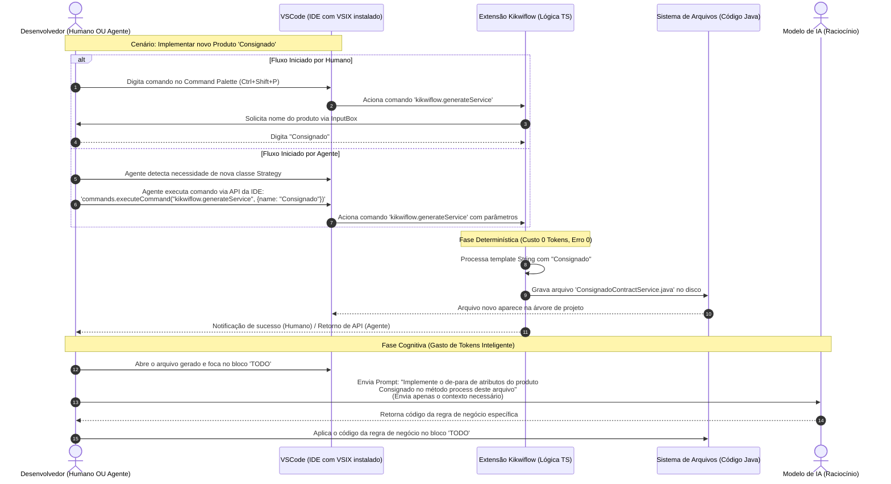

Hoje não venho aqui para filosofar ou falar de assuntos abstratos. Vim compartilhar um pouco do que tem mudado radicalmente na forma como desenvolvo projetos Java.

Todo desenvolvedor sabe a dor que é trocar de ferramenta depois de anos acostumado com atalhos e funcionalidades (eu mesmo passei por isso migrando do NetBeans para o Eclipse, e por último para o IntelliJ). Nesses últimos anos, cheguei a flertar com o VSCode em alguns momentos, mas em todas as tentativas acabava voltando para o IntelliJ porque não via um ganho real que justificasse abandonar a ferramenta que eu já dominava.

Pois bem, agora isso mudou. E o negócio é aquele clássico: o problema não é você, sou eu! O IntelliJ continua sendo uma ferramenta excepcional, e acho que para quem ainda escreve código Java 100% "na unha", segue sendo o melhor. Acontece que, recentemente, comecei a experimentar uma forma diferente de atuar nos projetos usando IA (principalmente com o Kikwiflow).

Vou tentar explicar de uma forma pragmática para que vocês consigam chegar à mesma conclusão que eu:

Os "gurus" da onda costumam falar muito sobre MCP, GraphEngineering, Spec Driven, blábláblá. Mas o fato é que: quanto mais do processo de desenvolvimento a gente delega para os agentes, maior o custo e a incerteza sobre o output. A exceção seria se você estivesse em um ambiente extremamente maduro, com um pipeline lindo e testes cobrindo todas as novas funcionalidades e regressivos — algo que eu NUNCA vi 100% funcional em empresa/projeto grande.

Então, vamos pensar como engenheiros: como podemos economizar e aumentar nosso grau de certeza? Fine Tuning? RAG? Skills? Não! Toda empresa ou projeto que trabalhei até hoje possui um grau de padronização: rest clients, consumers, producers, etc. Se eu sei que essas classes têm um padrão rígido, por que vou delegar para o modelo criá-las do zero toda vez?

Uma hora dessas eu paro e conto a história da carochinha de como cheguei a essa solução, mas resumindo: desde 2019 eu brinco com essa coisa de "código que gera código" (tem até um projetinho no meu Git dessa época). Sou deveras preguiçoso quando o assunto é trabalho repetitivo, então nos últimos anos acabei aprimorando isso (em um banco que atuei, chegamos a fazer um processo que automatizava a criação de novos produtos direto no orquestrador).

Não estou reinventando a roda. Quando o dev clica com o botão direito e pede para a IDE gerar getters e setters, é mais ou menos a mesma lógica. Eu só estou conectando pontos, porque quando você para e pensa, chega a ser óbvio: se há padrão, você não precisa delegar ao modelo; você pode gerar o código de forma determinística com boilerplates e deixar para o modelo só o que de fato é "terreno novo". Você não colocaria seu profissional mais caro para ficar batendo tecla em tarefa que é ctrl+c / ctrl+v, certo?

## Legal, mas como isso se liga com a IDE e por que estou migrando para o VSCode?

Existem diversas formas de criar e usar esses geradores de código (templates, scripts, CLI), mas um dos pilares do Kikwiflow é a Developer Experience (DX). Eu preciso que o profissional mude o mínimo possível de contexto. Para isso, o caminho natural era criar uma extensão que rodasse no próprio ambiente de desenvolvimento.

Porém, quando falamos de DX hoje, não devemos pensar somente em humanos como desenvolvedores, mas também em agentes. Como criar algo útil para ambos? A solução "da moda" seria criar um servidor MCP, mas isso feriria outro pilar nosso: segurança e governança. Comecei a ver como colocar os boilerplates na IDE de forma que o agente co-piloto conseguisse acioná-los. Afinal, assim como o agente invoca um MCP, ele tem capacidade de rodar comandos da IDE.

Foi aí que comecei a torcer o nariz para o IntelliJ.

As ferramentas de modelagem e monitoramento do Kikwiflow foram todas desenvolvidas no ecossistema JS/TS. Eu já tinha boa parte dos boilerplates rodando em Node para o nosso initializr. Obviamente, eu não queria reescrever essa lógica em Kotlin e conviver com o custo de manter dois repositórios fazendo a mesma coisa. Decidi testar a complexidade de plugar isso no VSCode e... voilà! Simples demais. Graças aos protocolos internos, os mesmos boilerplates que a UI do modelador invoca podem ser invocados pelo agente rodando dentro da IDE.

## Mão na massa: como funciona a geração na prática

Para deixar a ideia bem clara, pense na integração de um serviço de emissão de contratos bancários. Toda vez que criamos um processador para um novo produto (ex: Consignado, Imobiliário), a estrutura de chamada HTTP, mapeamento básico da resposta e persistência no banco é idêntica.

Em vez de deixar o agente "tentar adivinhar" a sintaxe disso via prompt, nós criamos um gerador estático simples em JS/TS (`generator.ts`):

```typescript
import * as fs from 'fs';
import * as path from 'path';

export function generateContractService(targetPath: string, productName: string) {
  const className = `${productName}ContractService`;

  const javaCode = `package com.banco.contratacao.service;

import org.springframework.stereotype.Service;
import lombok.RequiredArgsConstructor;

@Service
@RequiredArgsConstructor
public class ${className} implements ContractProcessor {

    private final ProductApiClient productApiClient;
    private final ContractRepository contractRepository;

    @Override
    public ContractResult process(ContractRequest request) {
        // 1. Chamada padronizada da API de Domínio (Determinístico)
        var apiRequest = new ApiContractRequest(request.getProductId(), request.getCustomerId());
        var apiResponse = productApiClient.issueContract(apiRequest);

        // 2. Estrutura base de persistência (Determinístico)
        var entity = new ContractEntity();
        entity.setContractNumber(apiResponse.getContractNumber());
        entity.setProductType("${productName.toUpperCase()}");
        entity.setStatus(ContractStatus.PENDING);

        // TODO: [AGENTE] Implementar regras específicas de mapeamento de de-para do produto ${productName}

        return contractRepository.save(entity);
    }
}`;

  fs.writeFileSync(path.join(targetPath, `${className}.java`), javaCode);
}
```

No VSCode, basta expor essa função como um comando simples da extensão (`extension.ts`):

```typescript
import * as vscode from 'vscode';
import { generateContractService } from './generator';

export function activate(context: vscode.ExtensionContext) {
  let disposable = vscode.commands.registerCommand('kikwiflow.generateService', async (uri: vscode.Uri) => {
    const productName = await vscode.window.showInputBox({ prompt: "Nome do Produto Java" });
    if (productName) {
      generateContractService(uri.fsPath, productName);
      vscode.window.showInformationMessage(`Boilerplate gerado em milissegundos!`);
    }
  });
  context.subscriptions.push(disposable);
}
```

Com um simples `npx vsce package`, empacotamos isso em um arquivo `.vsix` instalável em qualquer VSCode da empresa.

### E como o agente atua aqui?

Quando dou o comando de implementação para o agente na IDE, ele não gasta mil tokens tentando escrever as anotações do Spring, injeções do Lombok ou chamadas de repositório. O próprio agente invoca o comando `kikwiflow.generateService` da IDE, a classe Java nasce pré-preenchida em 10 milissegundos, e o agente usa seus tokens e raciocínio exclusivamente no bloco marcado para regras de negócio específicas.

## Visualizando a interação: humano vs. agente

Para deixar clara a distinção de papéis e como a extensão no VSCode serve de ponte para ambos, preparei um diagrama de sequência que ilustra o fluxo de trabalho.

Repare que o ponto de partida é o mesmo, mas a execução da parte "chata" (o boilerplate) é delegada para a automação determinística, seja por comando humano ou por chamada de API pelo agente.



**Entendendo o diagrama:**

- **Gatilho híbrido (passos 1 a 4):** a beleza dessa abordagem é que a IDE não se importa se quem chamou o comando foi um dedo humano no teclado ou um script de agente. O resultado é o mesmo: a intenção de criar algo padronizado é capturada.
- **Abertura do abismo (fase determinística):** é aqui que economizamos tempo e dinheiro. O processo de criação do arquivo e preenchimento da estrutura básica (anotações, imports, injeções de dependência) acontece localmente, sem consultar nenhuma IA. É rápido, gratuito e à prova de erros.
- **Uso nobre da IA (fase cognitiva):** só depois que a "carcaça" está pronta e garantida pela arquitetura é que chamamos o modelo de linguagem. O prompt fica infinitamente menor e mais preciso, pois o agente já tem o arquivo pronto e só precisa focar em preencher a lógica de negócio específica no local exato.

## DevEx como centro de custos e governança na era da IA

Essa abordagem traz um aprendizado corporativo crítico: o papel da Developer Experience (DevEx) mudou fundamentalmente.

Antes, falávamos de DevEx apenas sob a ótica de "deixar o desenvolvedor feliz" ou acelerar o onboarding. Hoje, em times que utilizam LLMs e agentes no dia a dia, a DevEx atua diretamente no FinOps (custo de tokens) e na governança da arquitetura.

Deixar que cada desenvolvedor crie prompts livres para gerar estruturas que poderiam ser determinísticas gera dois grandes gargalos:

- **Custo computacional desnecessário:** milhares de tokens gastos diariamente para reproduzir código repetitivo que um script estático gera de graça.
- **Anarquia arquitetural:** variações imprevisíveis de código entre membros do mesmo time, aumentando a dívida técnica e criando pontos cegos em auditorias de segurança.

Criar ecossistemas de extensões internas leves deixou de ser um luxo de engenharia para se tornar uma decisão estratégica de eficiência financeira. O time de engenharia do futuro não constrói apenas pipelines de CI/CD; ele desenvolve as ferramentas e restrições para que humanos e agentes trabalhem juntos com máxima precisão e menor custo.

É claro que desapegar do IntelliJ deixa marcas. A navegação, refatoração profunda e análise estática dele ainda são impecáveis. Mas, no momento em que você passa a enxergar a IDE não mais como um editor isolado, e sim como um sistema operacional onde humanos e agentes colaboram, o VSCode ganha por sua leveza, extensibilidade e ecossistema aberto.

No fim das contas, a minha migração não é sobre rebaixar o Java, mas sobre entender a evolução do nosso papel: deixamos de ser digitadores de boilerplate para nos tornarmos arquitetos do ambiente onde a IA trabalha.

Se a sua IDE limita a precisão e a autonomia do seu agente, talvez não seja a sua estratégia que precise mudar — é o seu ambiente.
